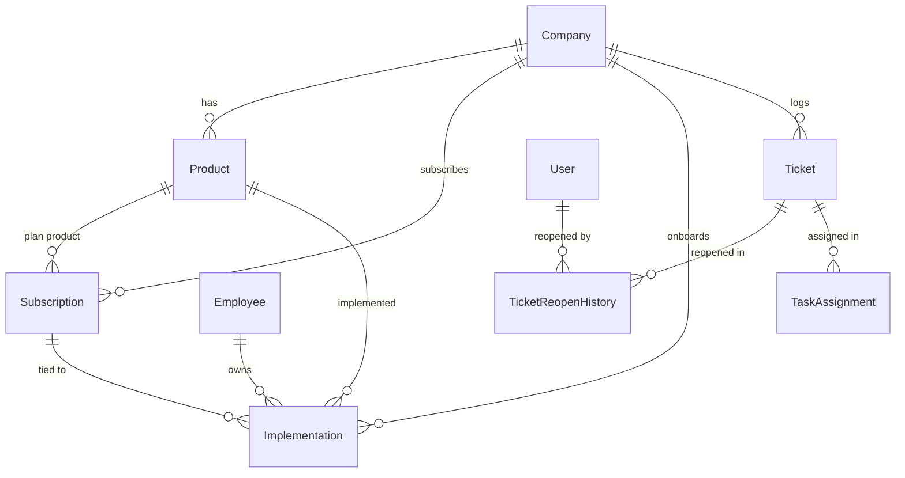

# KANVTECH Advanced Admin + Customer Workflow Implementation Plan

## 1. Executive Summary & Scope
This plan details the end-to-end implementation for the advanced business and UI enhancements requested for the KANVTECH Service Management Platform. The existing system (NestJS + Prisma/PostgreSQL + Next.js 14) remains intact with zero regressions to authentication, RBAC, multi-tier timer, SLA, and live Railway compatibility.

---

## 2. Architecture & Data Model Additions

### A. New Prisma Models & Schema Extensions

1. **`Product`**:
   - `id`: String (`@id @db.VarChar(50)`) e.g. `PRD-0001`
   - `code`: String (`@unique @db.VarChar(50)`)
   - `name`: String (`@db.VarChar(200)`)
   - `description`: String? (`@db.Text`)
   - `category`: String (`@db.VarChar(100)`)
   - `isActive`: Boolean (`@default(true)`)
   - `createdAt`: DateTime (`@default(now())`)
   - `updatedAt`: DateTime (`@updatedAt`)

2. **`Subscription` (Annual Maintenance / AMC / Subscription Management)**:
   - `id`: String (`@id @db.VarChar(50)`) e.g. `AMC-0001`
   - `companyId`: String (`@db.VarChar(50)`)
   - `productId`: String (`@db.VarChar(50)`)
   - `planName`: String (`@db.VarChar(150)`)
   - `startDate`: DateTime
   - `expiryDate`: DateTime
   - `renewalDate`: DateTime?
   - `status`: `SubscriptionStatus` (`ACTIVE`, `EXPIRING_SOON`, `EXPIRED`, `RENEWED`)
   - `warningState`: String? (`@db.VarChar(50)`)
   - `lastWarningSentAt`: DateTime?
   - `annualCost`: Float?
   - `notes`: String? (`@db.Text`)
   - `createdAt`: DateTime (`@default(now())`)
   - `updatedAt`: DateTime (`@updatedAt`)

3. **`Implementation` (New Customer Implementation Management)**:
   - `id`: String (`@id @db.VarChar(50)`) e.g. `IMP-0001`
   - `companyId`: String (`@db.VarChar(50)`)
   - `productId`: String (`@db.VarChar(50)`)
   - `subscriptionId`: String? (`@db.VarChar(50)`)
   - `ownerEmployeeId`: String? (`@db.VarChar(50)`)
   - `teamMembersJson`: String? (`@db.Text`)
   - `startDate`: DateTime
   - `targetGoLiveDate`: DateTime
   - `actualGoLiveDate`: DateTime?
   - `status`: `ImplementationStatus` (`NEW`, `PLANNING`, `IN_PROGRESS`, `CONFIGURATION`, `TESTING`, `READY_FOR_GO_LIVE`, `LIVE`, `COMPLETED`, `BLOCKED`)
   - `progressPercent`: Int (`@default(0)`)
   - `pendingActivities`: String? (`@db.Text`)
   - `notes`: String? (`@db.Text`)
   - `completedAt`: DateTime?
   - `createdAt`: DateTime (`@default(now())`)
   - `updatedAt`: DateTime (`@updatedAt`)

4. **`TicketReopenHistory`**:
   - `id`: Int (`@id @default(autoincrement())`)
   - `ticketId`: String (`@db.VarChar(50)`)
   - `customerUserId`: Int
   - `reopenReason`: String (`@db.Text`)
   - `previousStatus`: TicketStatus
   - `reopenedAt`: DateTime (`@default(now())`)

5. **`TicketStatus` Enum Extension**:
   - Add `REOPENED` (or support explicit reopen state while continuing through `IN_PROGRESS`).

---

## 3. Backend Modules & Endpoint Specifications

### A. `ProductModule` (`/api/products`)
- `GET /api/products`: List products with search, category filter, active filter, pagination.
- `GET /api/products/:id`: Get product details.
- `POST /api/products`: Create product (Admin / Manager only).
- `PUT /api/products/:id`: Update product details (Admin / Manager only).
- `POST /api/products/:id/status`: Toggle active status (Admin only).

### B. `TaskAllotment` & Direct Assignment (`/api/task-allotment` / `/api/tickets/:id/assign`)
- Direct assignment allows Admin and Manager to assign any ticket directly to any eligible active employee (L1, L2, L3).
- Records `TICKET_ASSIGNED` / `TICKET_REASSIGNED` with previous assignee, new assignee, assignedBy actor, timestamp, and optional notes.
- Separate from escalation: Does NOT trigger `TICKET_ESCALATED` or alter level tier prematurely.
- `GET /api/task-allotment/tickets`: Retrieve all tickets formatted for allotment triage with workload metrics.
- `POST /api/task-allotment/assign`: Direct assignment endpoint with validation.

### C. `SubscriptionModule` (`/api/subscriptions` / `/api/maintenance`)
- `GET /api/subscriptions`: List subscriptions with status filter (`ACTIVE`, `EXPIRING_SOON`, `EXPIRED`, `RENEWED`), company, product, date range, pagination.
- `GET /api/subscriptions/stats`: Summary counts for dashboard integration.
- `POST /api/subscriptions`: Create customer subscription.
- `PUT /api/subscriptions/:id`: Update subscription.
- `POST /api/subscriptions/:id/warning`: Send/record warning reminder to customer company.
- `POST /api/subscriptions/:id/renew`: Renew subscription with new period and history tracking.

### D. `ImplementationModule` (`/api/implementations`)
- `GET /api/implementations`: List implementations with search, status filters, owner filter, pagination.
- `GET /api/implementations/stats`: Summary counts for dashboard.
- `POST /api/implementations`: Create new customer implementation project.
- `PUT /api/implementations/:id`: Update progress %, status, go-live dates, and pending activities.
- `GET /api/implementations/:id`: Get full details.

### E. Customer Reopening, Feedback & 2-Ticket Limit (`/api/tickets/*`)
- `POST /api/tickets/:id/reopen`:
  - Validates caller is customer owner of ticket (or authorized manager).
  - Validates ticket is in `RESOLVED`, `MANAGER_REVIEW`, or `CUSTOMER_FEEDBACK` state.
  - Updates ticket status to `IN_PROGRESS` (or `REOPENED`), records `TicketReopenHistory`, logs audit event `CUSTOMER_REOPENED_TICKET`, restarts resolution work session timer.
- `POST /api/tickets`:
  - Strict server-side enforcement: `validateTwoOpenTicketRule(customerContactId)`. Rejects with HTTP 400 when active ticket count >= 2.
- `POST /api/tickets/:id/feedback`:
  - Customer rates (1-5 stars) and enters remarks -> transitions to `CLOSED`.

---

## 4. Frontend Web Portal Enhancements

1. **Login Page (`LoginPage.tsx`)**:
   - Password visibility toggle (eye icon button, accessible, masked/unmasked toggle without layout shift).
   - "Remember me" checkbox (safely remembers email in localStorage; passwords are never stored in plaintext).
2. **Product Master (`ProductsPage.tsx`)**:
   - Enterprise data table with Add Product modal, Edit modal, Category & Active status filters, search bar.
3. **Task Allotment (`TaskAllotmentPage.tsx`)**:
   - Direct ticket allocation workspace showing eligible employees by workload/availability, assign/reassign modal with notes.
4. **Annual Maintenance / Subscriptions (`MaintenancePage.tsx`)**:
   - AMC tracking table with countdown days remaining, warning indicators, Send Warning action modal, Renew action modal.
5. **New Implementations (`ImplementationsPage.tsx`)**:
   - Implementation onboarding pipeline tracking with progress bars, lifecycle badges, team assignment, go-live dates.
6. **Customer Reopen & Enhanced Workflow in `TicketDetailPage.tsx` & `CustomerMobileView.tsx`**:
   - Customer sees `[Reopen Ticket]` when ticket is in customer verification / feedback state.
   - Reopen modal prompting for required reason.
   - Reopen history timeline drawer.
   - CSAT rating stars (1-5) and feedback submission.
   - Friendly 2-ticket quota alert when customer approaches limit.
7. **Date / Time Formatting Fix (`src/utils/date.ts`)**:
   - Global robust formatting functions replacing all vulnerable `new Date()` calls, eliminating "Invalid Date".
8. **Sidebar Navigation (`Sidebar.tsx`) & Layout**:
   - Reorganized into `Core Operations`, `Business Management`, `Administration`, and `Mobile Interfaces`.
9. **Dashboard (`DashboardPage.tsx`)**:
   - Integrated real metrics from Products, Subscriptions, Implementations, and Tickets.

---

## 5. Execution Stages

| Phase | Milestone | Expected Deliverables |
| :--- | :--- | :--- |
| **Phase 1** | Codebase Audit & Schema Update | Updated `schema.prisma`, migrations applied cleanly, database seeded |
| **Phase 2** | Backend Business Modules | `ProductModule`, `SubscriptionModule`, `ImplementationModule`, `TaskAllotment` |
| **Phase 3** | Customer Reopen & 2-Ticket Rule | Reopen endpoints, feedback adjustments, server-side quota guard |
| **Phase 4** | Frontend Pages & UI Components | `ProductsPage`, `TaskAllotmentPage`, `MaintenancePage`, `ImplementationsPage`, Login updates |
| **Phase 5** | Date Bug Fix & UI Integration | Safe date utility across all components, sidebar navigation, updated Dashboard |
| **Phase 6** | Automated Tests & Regression | Business test suite + QA API suite updated and passing 100% |
| **Phase 7** | End-to-End Verification & Report | Local browser validation & final comprehensive report |
